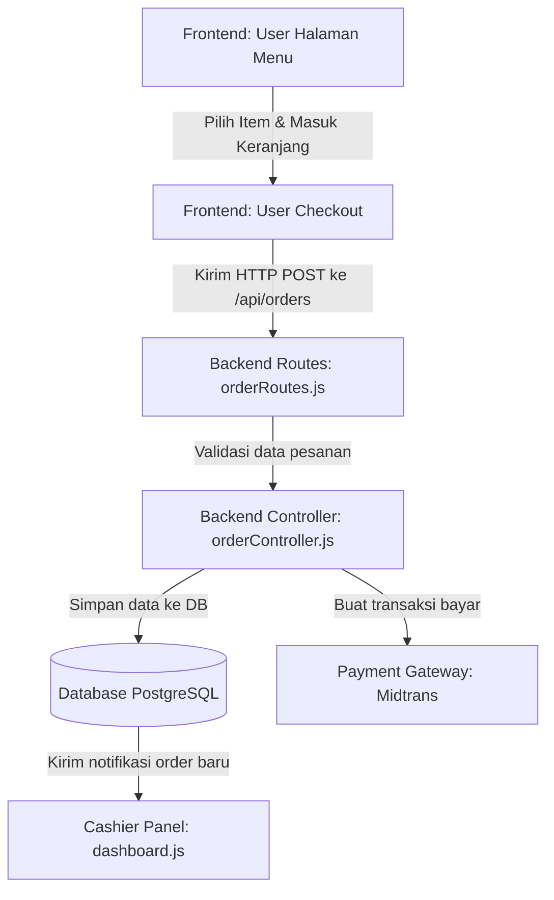

# QR Ordering - Sistem Pemesanan Kafe Berbasis QR

Sistem pemesanan berbasis QR Code terintegrasi untuk pelanggan restoran/kafe dan manajemen dapur kasir. Project ini menggunakan **Node.js, Express, PostgreSQL (Supabase)**, serta frontend murni (Vanilla JS/CSS/HTML) untuk pelanggan dan admin.

---

## 📂 Panduan Arsitektur & Peta Alur Codebase

Selamat datang di Panduan Belajar Codebase QR-Ordering! Bagian ini dirancang khusus untuk pemula agar Anda bisa memahami **apa tugas setiap file**, **ke mana arah tujuannya**, **fungsi utamanya**, serta **bagaimana cara kerjanya**.

### Struktur Folder & File Utama

```text
qr-ordering/
├── 📁 database/          # Skema database & data awal (seeds)
│   ├── schema_postgres.sql   # Struktur tabel database (PostgreSQL / Supabase)
│   ├── seeds_postgres.sql    # Data dummy awal (Kopi, Admin, dll.) untuk PostgreSQL
│   ├── schema.sql            # Cadangan struktur tabel versi MySQL
│   └── seeds.sql             # Cadangan data dummy versi MySQL
│
├── 📁 backend/           # Server API (Logika Bisnis)
│   ├── server.js             # Entry point utama (menjalankan server Node.js)
│   ├── 📁 scripts/           # Script utilitas (tes koneksi, smoke test)
│   │   ├── check-syntax.js      # Memeriksa sintaks kode agar tidak ada error typo
│   │   └── smoke-test.js        # Mengetes fungsionalitas API utama secara otomatis
│   │
│   └── 📁 src/               # Source code utama backend
│       ├── app.js               # Pengaturan Express, Middleware, dan rute file statis
│       ├── 📁 config/           # Konfigurasi basis data & keamanan
│       │   ├── db.js                # Koneksi database pool & migrasi otomatis
│       │   └── cors.js              # Keamanan pembatasan akses API dari luar
│       │
│       ├── 📁 controllers/      # Otak Logika (Memproses permintaan klien)
│       │   ├── authController.js    # Login admin & staff
│       │   ├── menuController.js    # CRUD Menu makanan/minuman (Katalog)
│       │   ├── categoryController.js # Manajemen Kategori (Coffee/Snack)
│       │   ├── discountController.js # Manajemen Voucher & Diskon
│       │   ├── orderController.js   # Pembuatan pesanan & integrasi Midtrans
│       │   ├── publicController.js  # API umum pelanggan & Notifikasi Webhook
│       │   ├── settingsController.js# Pengaturan Pajak & Biaya Servis
│       │   └── reportController.js  # Laporan Rekap Pendapatan & Grafik
│       │
│       ├── 📁 middlewares/      # Penjaga Gerbang (Penyaring request)
│       │   ├── adminAuth.js         # Validasi cookie login admin
│       │   ├── adminLoginRateLimit.js# Pembatas percobaan login (anti-hack)
│       │   ├── errorHandler.js      # Penanganan crash program secara aman
│       │   └── publicRateLimit.js   # Pembatas spam request pesanan
│       │
│       ├── 📁 routes/           # Alamat API (Endpoint)
│       │   └── index.js             # Menggabungkan seluruh alamat API
│       │
│       └── 📁 utils/            # Alat Pembantu (Helper)
│           ├── adminToken.js        # Enkripsi sesi JWT Token admin
│           ├── date.js              # Format tanggal lokal Indonesia
│           ├── discount.js          # Algoritma validasi kupon belanja
│           ├── midtrans.js          # Integrasi pembayaran cashless QRIS
│           ├── uploadStorage.js     # Upload gambar ke Supabase Storage Cloud
│           ├── validation.js        # Pengecek validitas input form
│           └── websocket.js         # Pengiriman notifikasi pesanan real-time
│
└── 📁 frontend/          # Tampilan Web (HTML, CSS, JS)
    ├── 📁 user/              # Halaman Pemesanan untuk Pelanggan (Meja QR)
    │   ├── pages/index.html     # Halaman Beranda (Landing page promo)
    │   ├── pages/menu.html      # Katalog menu & pop-up detail varian Hot/Ice
    │   ├── pages/checkout.html  # Formulir pesanan, meja, & bayar QRIS
    │   └── pages/status.html    # Tracker status masak dapur real-time
    │
    └── 📁 admin/             # Panel Dashboard Kasir & Pemilik
        ├── pages/login.html     # Login staff kasir
        ├── pages/dashboard.html # Dapur kasir: antrean pesanan & kelola status
        ├── pages/menu.html      # Tambah/edit menu & stok habis
        ├── pages/settings.html  # Manajemen kasir, pajak cafe, & biaya servis
        └── pages/report.html    # Laporan penjualan harian
```

---

## 🎯 Peta Alur Aplikasi (Bagaimana Data Mengalir)

Ketika pelanggan memesan kopi, alurnya berjalan seperti ini:



---

## 🚀 Menjalankan Project Secara Lokal

### Prasyarat
- Node.js versi 18 ke atas sudah terinstal di komputer.
- Database PostgreSQL (lokal atau cloud Supabase).

### Langkah Instalasi

1. **Install dependency**:
   ```bash
   npm install
   ```

2. **Pengaturan Environment (.env)**:
   Buat file `.env` di folder root dengan menyalin file `.env.example`. Sesuaikan isinya:
   - Hubungkan database dengan mengisi `DATABASE_URL` atau data host DB.
   - Isi API Key Midtrans (`MIDTRANS_SERVER_KEY`, dll.) untuk fitur QRIS.

3. **Inisialisasi Database (Setup Data Awal)**:
   Buka database client Anda (atau SQL Editor di Supabase), jalankan file SQL sesuai urutan berikut:
   *   Pertama, jalankan file **`database/schema_postgres.sql`** (membuat struktur tabel).
   *   Kedua, jalankan file **`database/seeds_postgres.sql`** (memasukkan data awal & akun admin bawaan).

4. **Jalankan server development**:
   ```bash
   npm run dev
   ```

5. **Buka aplikasi di Browser**:
   *   **Halaman Pelanggan**: [http://localhost:4000/](http://localhost:4000/)
   *   **Panel Admin/Kasir**: [http://localhost:4000/admin](http://localhost:4000/admin) *(Username: `admin`, Password: `admin123`)*
   *   **Alamat API**: [http://localhost:4000/api](http://localhost:4000/api)

---

## 🛠️ Script Penting di package.json

Anda bisa menjalankan perintah-perintah ini di terminal:
*   `node backend/scripts/check-syntax.js --backend` : Memeriksa syntax error pada kode backend.
*   `node backend/scripts/check-syntax.js --frontend` : Memeriksa syntax error pada kode frontend.
*   `node backend/scripts/smoke-test.js` : Menjalankan tes otomatis endpoint penting.
*   `node backend/scripts/hash-password.js` : Helper untuk membuat password baru yang di-hash bcrypt.

---

## 🔐 Keamanan dan Operasional bawaan
- **Rate Limiting**: IP dibatasi jika gagal login berkali-kali untuk menghindari serangan peretasan paksa.
- **Sesi Keamanan**: Sesi login admin menggunakan cookie `httpOnly` agar token tidak bisa dicuri menggunakan script malicious (XSS).
- **Validasi Server-Side**: Perhitungan uang, diskon, dan PPN dilakukan langsung di server agar data transaksi akurat dan tidak dapat dimanipulasi dari sisi browser pengguna.
